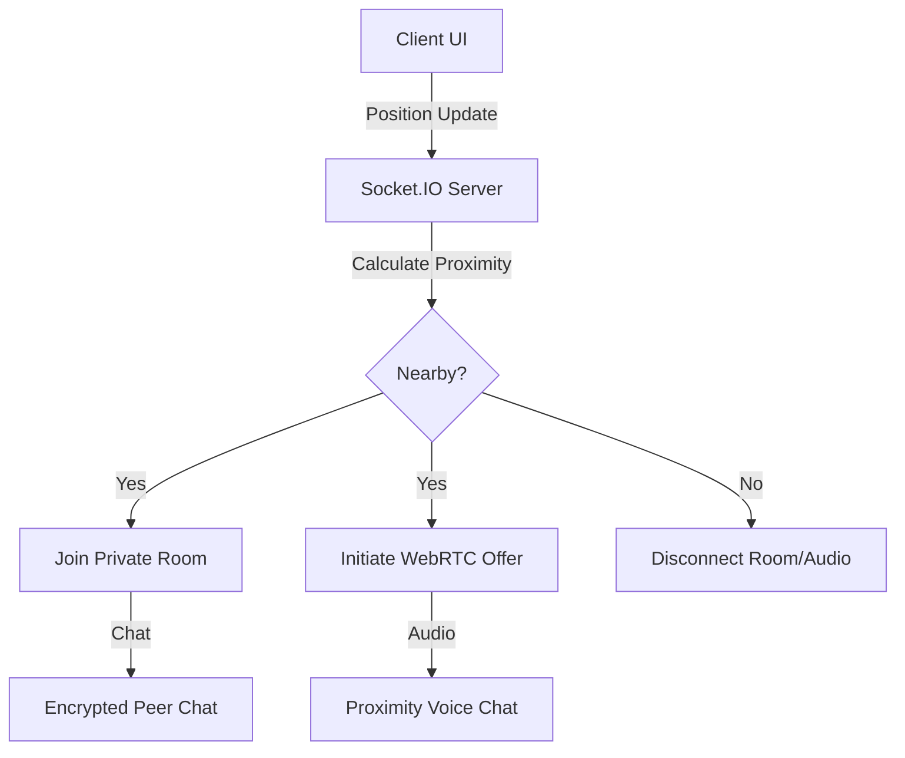

# 🌌 Virtual Cosmos – Assignment Submission

A high-performance, real-time 2D social environment where users can meet and interact through **proximity-based chat and audio**. This project simulates real-world social dynamics in a digital space.

---

## 🚀 Live Demo & Access

> [!IMPORTANT]
> **Live Site:** [https://virtual-cosmos-assignment.vercel.app/](https://virtual-cosmos-assignment.vercel.app/)  
> **Backend Status:** The frontend is configured to connect to your deployed backend URL. If the server is offline, the interface will show a warning.

---

## ✨ Core Features (Assignment Requirements)

- [x] **User Movement**: Multi-directional movement (WASD/Arrows) using **PixiJS** for smooth, 60fps canvas rendering.
- [x] **Real-Time Multiplayer**: All user positions are synced across all clients with ultra-low latency using **Socket.IO**.
- [x] **Proximity Detection**: Automatic detection of nearby users using a 150px radius logic.
- [x] **Smart Chat System**: 
    - Automatically joins a private room when users enter proximity.
    - Seamlessly disconnects when users move apart.
    - Minimalist slide-in chat panel for messaging.
- [x] **UI/UX**: Clean, glassmorphic interface showing avatars, active connections, and a dynamic HUD.

---

## 💎 Bonus Features (Above & Beyond)

1.  **📡 Radar Mini-map**: A real-time, pulsing radar in the HUD that shows yours and other players' positions across the entire map.
2.  **🏃 Human-like Animated Avatars**: We replaced simple circles with composite character models (Body, Head, Eyes) featuring **Walking Bobbing** and **Idle Breathing** animations.
3.  **🔊 Automatic Proximity Audio (Voice Chat)**: A peer-to-peer **WebRTC** voice link that activates automatically on proximity, allowing users to talk just like in real life.
4.  **🧭 Advanced Camera System**: A smooth-lerping camera that keeps your avatar centered in the infinite-feeling cosmos.
5.  **🌈 Dynamic Directional Facing**: Avatars flip horizontally based on their movement direction for better expressivity.
6.  **🎭 Social Emoji Reactions**: Real-time floating emotes (👋 ❤️ 😂 🔥) that sync across users for instant social feedback.
7.  **💬 Real-Time Typing Indicators**: See a "..." bubble above avatars and a "User is typing..." message in the chat panel while messages are being composed.

---

## 🏗 System Architecture



---

## 🛠 Tech Stack & Justification

| Technology | Role | Justification |
|---|---|---|
| **React (Vite)** | Frontend Framework | Fast development with high-performance bundling (Vite). Perfect for building the state-driven HUD overlay. |
| **PixiJS** | WebGL Rendering | Chosen over raw Canvas for its **GPU-accelerated** sprite system and optimized ticker. Essential for smooth animations. |
| **Zustand** | State Management | Far lighter than Redux. Perfect for high-frequency position updates without causing unnecessary React re-renders. |
| **Socket.IO** | Real-time Sync | Industry-standard for bi-directional socket communication. Handles automatic reconnections and rooms effortlessly. |
| **Node.js (Express)**| Backend Server | Scalable and handles asynchronous I/O (sockets) perfectly for a real-time game server. |
| **MongoDB** | Persistence | Stores user profiles and session data. Used an in-memory fallback for rapid development. |

---

## 🚀 Setup & Installation (Local)

### 1. Installation
The project is structured as a monorepo. You can install all dependencies (root, server, and client) with one command from the project root:

```bash
# From the virtual-cosmos folder
npm install
npm run install-all
```

### 2. Configure Environment
Create a `.env` file in the `server/` directory:
```env
PORT=3001
MONGO_URI=mongodb://localhost:27017/virtual-cosmos
CLIENT_URL=http://localhost:5173
```

### 3. Quick Start
To launch both the backend and the frontend simultaneously:

```bash
# From the project root
npm run dev
```

---

## 🌐 Production Deployment (Making it "Anyone Ready")

To make the site accessible to anyone on the internet, follow these steps:

### 1. Backend (Render.com)
1.  Create a new **Web Service** on [Render.com](https://render.com/).
2.  Connect this GitHub repository.
3.  Set the **Root Directory** to `server`.
4.  Set the **Build Command** to `npm install`.
5.  Set the **Start Command** to `node index.js`.
6.  Once deployed, copy your Render URL (e.g., `https://virtual-cosmos-server.onrender.com`).

### 2. Frontend (Vercel)
1.  Go to your project on Vercel.
2.  Navigate to **Settings > Environment Variables**.
3.  Add `VITE_BACKEND_URL` and set its value to your **Render URL**.
4.  Redeploy your Vercel project.

---

## 🛠 Troubleshooting

- **No Audio?** Browser security policies prevent audio from playing until you interact with the page. **Click anywhere** in the game after joining to enable the voice chat.
- **MongoDB Connection**: If the server logs `MongoDB unavailable`, it will automatically fall back to **In-Memory mode**, so you can still test all features without a local database.
- **Microphone Permissions**: Ensure you allow microphone access in your browser when prompted to enable proximity voice chat.

---

## 📂 Project Structure
```text
client/
├── src/
│   ├── components/       # UI Components (HUD, Chat, Join Screen, Canvas)
│   ├── hooks/            # Logic (Socket connection, Keyboard, WebRTC Audio)
│   ├── store/            # Zustand global game state (players, chat)
│   └── App.jsx           # Main Layout & Overlay logic
server/
├── services/             # Proximity calculation logic
├── models/               # MongoDB Database models
└── index.js              # Socket.IO & Express entry point
```

---

## 📄 License
MIT
